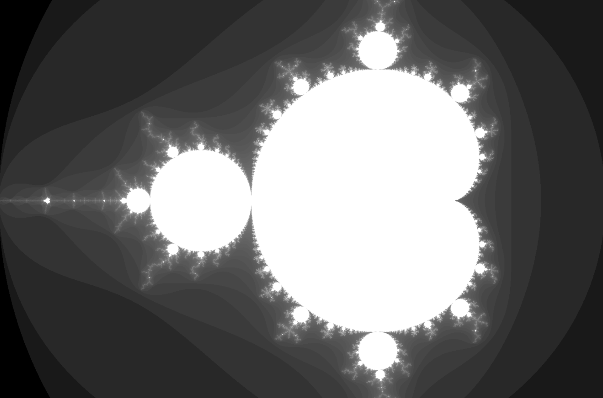

# 🧵 Advanced and Parallel Programming Project

**Author:** Tommaso Mingrone  
**Course:** Advanced and Parallel Programming

This repository contains a two-part academic project developed for the *Advanced and Parallel Programming* course. It explores:
- Fractal computation and parallelism in **C**
- Custom interpreter design in **Python**

---

## 📁 Repository Structure

The repository contains the full unzipped project directory, including both the C and Python parts:

```
ProjectC-PY/
├── Project_C/              # Part 1 – Mandelbrot image generator in C
│   ├── main.c
│   ├── mandelbrot.c/h
│   ├── pgm.c/h
│   ├── Makefile
│   ├── mandelbrot.pgm      # Output image
│   └── project_c.pdf       # C project specification
│
├── Project_PY/             # Part 2 – Custom interpreter in Python
│   ├── *.py
│   └── project_python.pdf  # Python project specification
```

---

## 🧠 Part 1 – Mandelbrot Set Visualization (C)

This program computes and visualizes the Mandelbrot fractal in grayscale using a binary PGM format.

### Features

- Parallel computation using OpenMP
- Memory-mapped I/O (`mmap`) for efficient image writing
- Outputs an image based on the divergence speed of each complex point
- Accepts 3 command-line arguments:
  1. Output filename
  2. Maximum iterations `M`
  3. Vertical resolution `nrows` (horizontal resolution is `1.5 * nrows`)

### Computational Domain

The image covers the complex plane in the region:

```
Real axis:      [-2.0, 1.0]
Imaginary axis: [-1.0i, 1.0i]
```

Each pixel represents a complex number `c`. The iteration `z = z² + c` is applied until either:
- The magnitude of `z` exceeds 2 (diverges), or
- The maximum number of iterations `M` is reached

Pixels are colored using:

- White (255) for points inside the Mandelbrot set
- Grayscale for diverging points, scaled by:
  ```
  floor(255 × log(n) / log(M))
  ```

### Sample Output

Generated with:

```
./mandelbrot mandelbrot.pgm 1000 1000
```



Image saved as `Project_C/ProjectC.pgm`.

---

## 🐍 Part 2 – Expression Language Interpreter (Python)

This part implements a stack-based interpreter for a minimal Lisp-like language.

### Supported Features

- Variable and array declarations: `alloc`, `valloc`, `setq`, `setv`
- Arithmetic operations: `+`, `-`, `*`, `/`, `%`
- Comparison operators: `=`, `!=`, `<`, `<=`, `>`, `>=`
- Control flow: `if`, `while`, `for`
- Subroutines: `defsub`, `call`
- Expression sequencing: `prog2`, `prog3`, `prog4`
- Side effects: `print`, `nop`

### Example

```lisp
x alloc
0 x setq
x 10 < x 1 + x setq prog2 while
x print
```

This declares a variable `x`, increments it while `x < 10`, and prints the result.

### Error Handling

The interpreter raises appropriate exceptions for:
- Undefined variables
- Type mismatches
- Out-of-bounds array access
- Incorrect number of arguments

---

## 🔧 How to Build and Run

### C Project

Requires a C compiler with OpenMP support.

```bash
cd Project_C
make
./mandelbrot mandelbrot.pgm 1000 1000
```

### Python Project

Requires Python 3.9 or later.

```bash
cd Project_PY
python3 main.py
```

Input can be passed via `stdin`, or integrated into `main.py`.

---

## 📚 References

- [PGM Format Specification](https://netpbm.sourceforge.net/doc/pgm.html)
- C Standard Library `complex.h`
- Python 3 documentation on exceptions and dictionaries

---

## 📝 Notes

- Both **Project_C** and **Project_PY** must be submitted to complete the project.
- All source files include author and student ID in the header comments.
- Full specifications are available in the provided PDFs.
